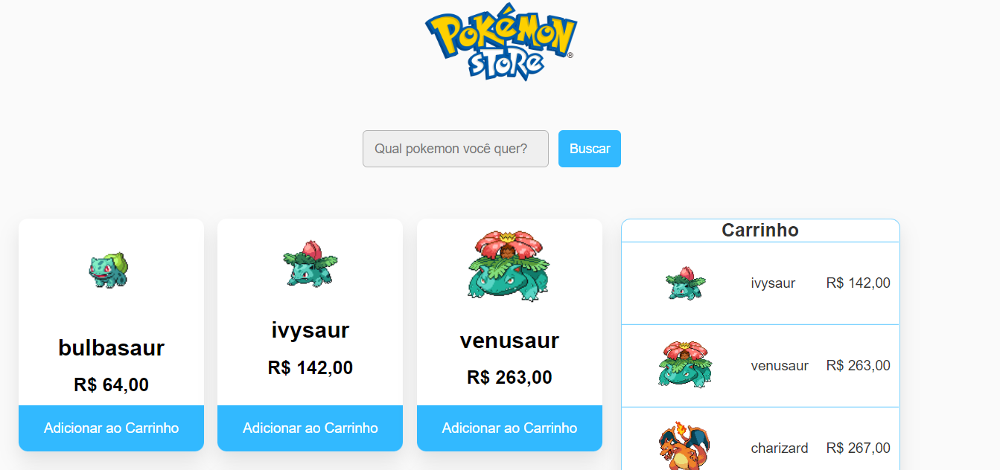

## Desafio Proposto na Jornada React - Gama Academy



## Objetivo
Desenvolver uma loja de pokemon com React. A loja deve ter uma página de listagem de pokemon, uma searchBar e o carrinho.

Opcional:
- Página de detalhes do pokemon

## O que fiz?
Não ficou do jeito que queria, infelizmente não tive muito tempo para fazer, mas fiz o que foi solicitado, faltou terminar a página de detalhes do pokemon.

## O que falta?
Queria refatorar, mas não daria tempo, farei isso em outro momento, mas poderia utilizar algumas classes no css e variáveis, também preciso rever o responsivo e adicionar um botão para fechar o carrinho.
O lint também parece não estar funcionando corretamente.

## Como testar?
Poder testar acessando [Poke Store](https://pokestore-coral.vercel.app/)

ou clonando o repositório e instalando as
dependências com yarn:

```bash
yarn install && yarn start
```


